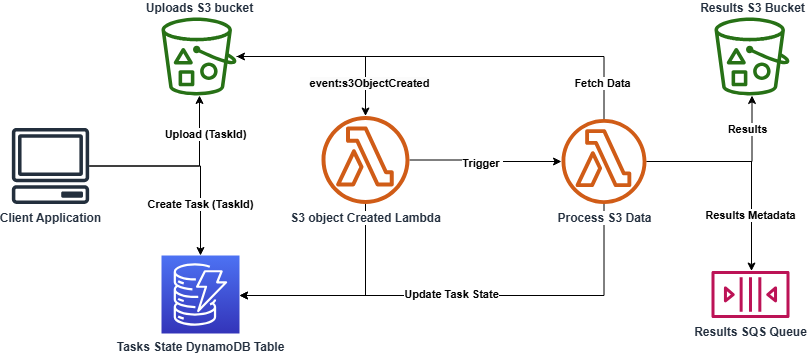

# AWS Task Queue Boilerplate

This project provides a boilerplate setup for a serverless task queue in AWS, including both code and Terraform configurations. It enables:

* **File Upload & Processing**: Upload files to an S3 bucket for automated processing.
* **Serverless Compute**: Process files using AWS Lambda functions.
* **Task State Management**: Track task progress in DynamoDB.
* **Result Storage & Messaging**: Output processed results to S3 and notify via SQS.



## Setting up and running the project

After the underlying steps are completed you should be able to run `app/process_files_in_task.py` script, which runs the task queue with test data in `app/example_data` and writes their results to `app/results` upon succesfull processing. Currently the only task implemented is summarization of text via claude 3.5


### Python

```bash
sudo apt update
sudo apt install python3 python3-venv python3-pip -y

python3 -m venv devenv
source devenv/bin/activate

pip install -r requirements.txt
```

### AWS tooling

#### AWS CLI

https://docs.aws.amazon.com/cli/latest/userguide/getting-started-install.html 
```
curl "https://awscli.amazonaws.com/awscli-exe-linux-x86_64.zip" -o "awscliv2.zip"
unzip awscliv2.zip
sudo ./aws/install
```

#### IAM user

https://docs.aws.amazon.com/cli/latest/userguide/getting-started-quickstart.html
Create AWS user with SSO or long term access key in IAM with access to used AWS resources for terraform eg. Admin rights.
```
aws configure sso
or
aws configure
=> fill in the info
```

The underlying table gives an idea of the used services and permissions:

| Resource                  | Minimum Permission                      |
|---------------------------|-----------------------------------------|
| **S3**                    | `s3:*`                                  |
| **Lambda**                | `lambda:*`                              |
| **IAM (for Lambda roles)** | `iam:CreateRole`, `iam:AttachRolePolicy`, `iam:PassRole` |
| **CloudWatch Logs**        | `logs:*`                               |
| **DynamoDB** | `dynamodb:*`                  |
| **API Gateway** | `apigateway:*`                        |
| **SQS**                   | `sqs:*`                                 |
| **Bedrock**               | `bedrock:*`                             |


#### AWS Bedrock

For bedrock You might need to separately request access rights for your account
https://docs.aws.amazon.com/bedrock/latest/userguide/getting-started.html

### Terraform
https://developer.hashicorp.com/terraform/tutorials/aws-get-started/install-cli

in `environments/.../terraform.tfvars` change the `s3` bucket `task_bucket_name` to some unique bucket name and set other variables as you please. 

```bash
region          = "eu-west-1"
task_bucket_name  = "YOUR_BUCKET_NAME"
environment     = "Development"
project         = "YOUR_PROJECT_NAME"
```

Then navigate to `cd/enviroments/dev` to create the AWS resources

```bash
terraform init
terraform plan
terraform apply
```

### Dev env variables

In `app/.env` set env variables

```bash
APP_NAME=YOUR_PROJECT_NAME
ENVIRONMENT=Development
REGION_NAME="eu-west-1"
BUCKET_NAME="YOUR_BUCKET_NAME"
SQS_QUEUE_URL="https://sqs.eu-west-1.amazonaws.com/YOUR-USER-ID/ResultsQueue.fifo"
```

___

## TODO:s

* Staging / prod env and CI/CD
* Retry mechanisms for failed tasks
* Use strong consistency mode to DynamoDB or add retries for updating task state (There is a very small change task is not created fast enough). https://stackoverflow.com/questions/55306845/is-dynamodb-item-available-for-querying-immediately


## Useful resources

### VS Code extensions

The following extensions are useful:

* [ms-python.python](https://marketplace.visualstudio.com/items?itemName=ms-python.python)
* [hashicorp.terraform](https://marketplace.visualstudio.com/items?itemName=HashiCorp.terraform)
* [Ruff](https://marketplace.visualstudio.com/items?itemName=charliermarsh.ruff)


### Tutorials:

https://github.com/awsdocs/aws-doc-sdk-examples/blob/main/python/example_code/


